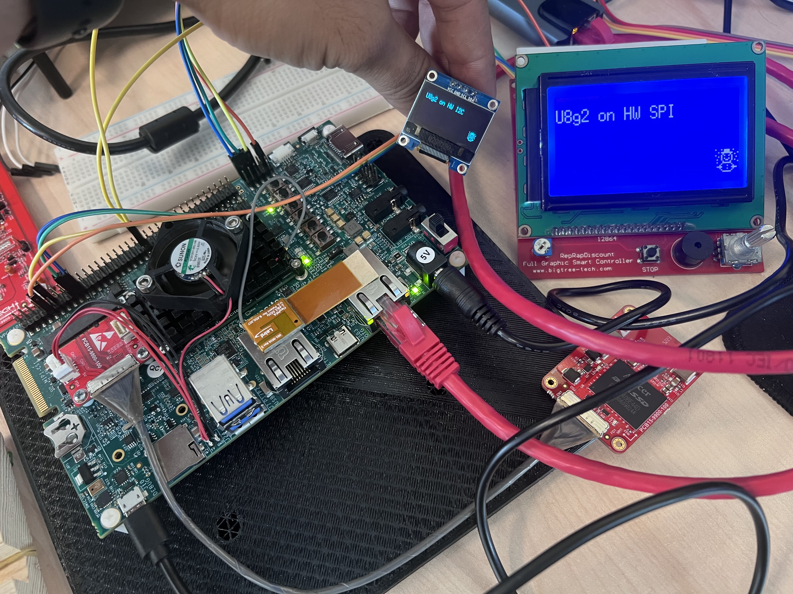

# u8g2 linux 

It's a modified repository for easily using screens like OLED or GLCD on ARM-based Linux devices. 
Honestly, I didn't make many changes to the source code. 
I just made the necessary modifications for it to work in a Linux environment.

You can cross-compile it statically and load it onto your board.

I did my example work on an IMX8. However, it will also work on other ARM-based Linux devices. 
The repository includes hardware SPI and I2C examples.

For SPI, I used the Full Graphic Smart Controller 128x64 (ST7920) screen that I had. 
For I2C, I used the 0.96 inch OLED 128x64 (SSD1306) screen.

#### Credits
- https://github.com/olikraus/u8g2
- https://github.com/wuhanstudio/u8g2-arm-linux

